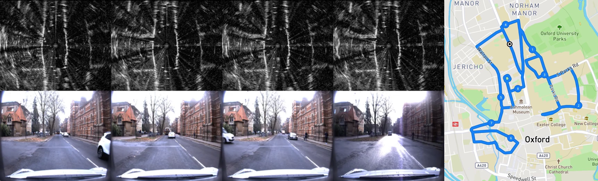

# Oxford Radar RobotCar Dataset SDK



This repo provides additional python helpers for the Oxford Radar RobotCar Dataset, A Radar Extension to the Oxford RobotCar Dataset (currently just a downloader utility).

Matlab and Python parsers for all the data are included in the original [**Oxford RobotCar Dataset SDK**](https://github.com/ori-mrg/robotcar-dataset-sdk)

Modules
-----------
All modules are contained in the base module `radar_robotcar_dataset_sdk`

`downloader`: Downloader script to automate and simplify downloading the Oxford Radar RobotCar Dataset


Obtaining Data
--------------
To obtain the data, please first register on the [dataset website website](http://ori.ox.ac.uk/datasets/radar-robotcar-dataset) to enable downloads for your Google account. Data can be downloaded manually via the website or using the script in this repository. 

Downloads are and separated into individual zip files for each sensor, for each traversal. It is recommended that you extract all tar files to the same directory - this will leave all the data in a sensible heirarchical directory structure. 


Installation 
--------------

```bash
# Either clone the package manually and add it to your PYTHONPATH or install it using:
pip install git+ssh://git@github.com/dbarnes/radar-robotcar-dataset-sdk.git
```

Data Download
--------------
The example code below assumes you have installed this repo as a package as described above

```bash
# Downlaoder help
python -m radar_robotcar_dataset_sdk.downloader.download --help

# Which will print
#  --datasets: Comma separated list of datasets to download (None is all)
#  --download_folder: Download folder (otherwise just list matching downloads)
#  --sensors: Comma separated list of sensors to download (None is all)
#  --[no]verbose: Verbosely print sensor information
#    (default: 'false')

# List, but dont download, all datasets and sensor downloads (no arguments)
python -m radar_robotcar_dataset_sdk.downloader.download

# Download Radar and GPS/INS Data from Two Datasets
python -m radar_robotcar_dataset_sdk.downloader.download \
	--datasets="2019-01-16-11-53-11-radar-oxford-10k,2019-01-16-13-09-37-radar-oxford-10k" \
	--sensors="Navtech CTS350x Radar,NovAtel GPS / INS" \
	--download_folder /tmp/oxford-radar-robotcar-dataset

# Will will prompt for a confirmation like below. Simply confirm to download data
# Finding Matching Files...
# ========================================================================================================================================================================================================================================
# Match No : Dataset                                          - Sensor                                             - Download Size     - Download Link
#        1 : 2019-01-16-11-53-11-radar-oxford-10k             - Navtech CTS350x Radar                              - 3.3 GB            - https://drive.google.com/file/d/1bQviDEkU20uq-xGeHrciaA5YeOr1-uyW
#        2 : 2019-01-16-11-53-11-radar-oxford-10k             - NovAtel GPS / INS                                  - 16.4 MB           - https://drive.google.com/file/d/1b1wNBtSumoqUeYxAMCwcjEKHPOZpn36h
# 
#        3 : 2019-01-16-13-09-37-radar-oxford-10k             - Navtech CTS350x Radar                              - 3.3 GB            - https://drive.google.com/file/d/17IP4JagskFe2q_yIky-wgBjUUYYtMXxl
#        4 : 2019-01-16-13-09-37-radar-oxford-10k             - NovAtel GPS / INS                                  - 16.5 MB           - https://drive.google.com/file/d/1vVlNaCqY2jwohm8k_oCOWyQKyB1jR8cq
# 
# Number of files to download: 4
# Total download size (before unpacking): 6.63 GB
# 
# Are you sure you want to download the above files and unpack to:
# /tmp/oxford-radar-robotcar-dataset
# 
# Do you wish to continue? [y/N]:
# 

# Download ALL datasets and ALL sensors (do not specify datasets or sensors)
python -m radar_robotcar_dataset_sdk.downloader.download \
	--download_folder /tmp/oxford-radar-robotcar-dataset
	
```
### Google Account Verification

We provide authorised downloads via Google Drive for each registered user. To automatically handle this we use a forked version of GDrive with Team Drive support which can be found at: `https://github.com/petrpulc/gdrive`. This binary is automatically downloaded and run as part of the download script. To use this binary you will need to give permission for the binary to use your credentials. When prompted simply follow the instructions (as shown below) by:

- Going to the url in your browser
- Selecting the Google Account which has been given download access
- Pasting the verification code back into the prompt

```
Using GDrive binary: /var/folders/yv/c2hy439111b_snjnhtdls87m0000gn/T/gdrive-osx-386

Authentication needed
Go to the following url in your browser:
https://accounts.google.com/o/oauth2/auth?...

Enter verification code:
<ENTER_CODE_HERE>

GDrive Authorised
```

Please note the automated download using GDrive is **completely optional** and you are free to download the files manually through your browser or devise some other means of downloading the files.

Details
-----------

Further details about the Oxford Radar RobotCar Dataset Dataset and associated projects can be found here: 
<br> [[Website]](https://ori.ox.ac.uk/datasets/radar-robotcar-dataset)

The dataset follows the same route and uses the same RobotCar platform as the original Oxford RobotCar Dataset, details of which can be found at:
<br> [[Website]](https://robotcar-dataset.robots.ox.ac.uk) &nbsp;&nbsp;[[Paper]](https://robotcar-dataset.robots.ox.ac.uk/images/robotcar_ijrr.pdf) &nbsp;&nbsp;[[SDK]](https://github.com/ori-drs/robotcar-dataset-sdk)


Citation
--------------
If you use this dataset in your research, please cite both the following papers:

```bibtex
@misc{
  OxfordRadarRobotCarDatasetWeb,
  author = {Barnes, Dan and Gadd, Matthew and Murcutt, Paul and Newman, Paul and Posner, Ingmar},
  title = {{Oxford Radar RobotCar Dataset}},
  howpublished = {\url{http://ori.ox.ac.uk/datasets/radar-robotcar-dataset}},
  year = {2019},
}
```
```bibtex
@article{RobotCarDatasetIJRR, 
  Author = {Will Maddern and Geoff Pascoe and Chris Linegar and Paul Newman}, 
  Title = {{1 Year, 1000km: The Oxford RobotCar Dataset}}, 
  Journal = {The International Journal of Robotics Research (IJRR)}, 
  Volume = {36}, 
  Number = {1}, 
  Pages = {3-15}, 
  Year = {2017}, 
  doi = {10.1177/0278364916679498}, 
  URL = {http://dx.doi.org/10.1177/0278364916679498}, 
  eprint = {http://ijr.sagepub.com/content/early/2016/11/28/0278364916679498.full.pdf+html}, 
  Pdf = {https://robotcar-dataset.robots.ox.ac.uk/images/robotcar_ijrr.pdf}
}
```

License
--------------
This work is licensed under a [Creative Commons Attribution-NonCommercial-ShareAlike 4.0 International License](http://creativecommons.org/licenses/by-nc-sa/4.0) and is intended for non-commercial academic use. If you are interested in using the dataset for commercial purposes please contact us.
